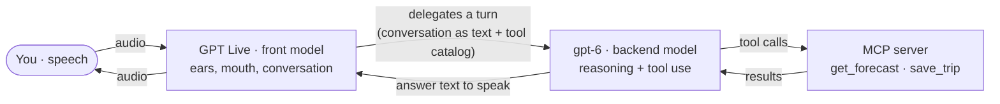

# Walkthrough: a voice agent that stays responsive while a second model thinks

This is the "why and how" companion to the [README](../README.md), which covers setup. It
explains the architecture, how the agent stays responsive, how each claim was verified, and
what the latency actually looks like.

## The problem

A single real-time voice model doing everything has a blind spot: the turn where it stops to
reason or wait on a tool is a turn it cannot also be listening or talking. The call goes dead
for a few seconds. In a demo you do not notice; in a real conversation it feels broken.

The fix is to split the work between two models.

## Two models, one assistant

**GPT Live (front model)** owns the live audio and the conversation. It understands your
speech, talks back, handles turn-taking, interruptions and backchannels, speaks the greeting
and any "let me check" filler, and answers simple things from memory. It decides, per turn,
whether a turn needs real thinking, and if so it hands that turn off. Your raw audio never
leaves it.

**gpt-6 (backend model)** is a reasoning specialist the front model consults mid-conversation.
When a turn is delegated, gpt-6 receives the conversation as text plus the tool catalog. It
chooses the candidate cities, calls `get_forecast`, compares the results, calls `save_trip`,
and composes the recommendation. That text comes back out through GPT Live's voice.

### What crosses the boundary

| Direction | Payload |
| --- | --- |
| Front → backend | the conversation as **text**, plus the tool definitions. No audio. |
| Backend → front | tool calls, and the final answer text to speak. |
| Backend ↔ MCP server | `get_forecast` with a chosen city list; `save_trip` with the choice; the results. |

Three properties are worth being precise about, because they are easy to assume wrong:

- **The backend sees the running conversation, not just the latest line.** Evidence: after a
  correction ("actually, Seville") the backend reused the *same* trip id from the earlier save,
  which it could only do by seeing the previous tool result in its context. It is subject to
  the service's own context management on long calls.
- **The backend does more than call tools.** It picks the cities itself, decides whether a tool
  is even needed, sequences multiple calls, and writes the spoken answer. A pure "repeat what
  you said" turn opens *no* delegation at all: the front model handles it alone.
- **The two share one history with no authorship tags.** Both models' output lands as plain
  assistant content in one session. Neither, reading the history, sees which model produced a
  given line. They are deliberately one assistant.

### Why this beats one model alone

- **Responsiveness.** The reasoning is off the voice loop, so the front model can keep
  listening and talking during the wait. That is the whole point.
- **Better decisions.** A real-time voice model is tuned for low-latency speech, not careful
  multi-step reasoning or reliable tool-calling. The backend does that part better.
- **Pay only when it helps.** The reasoning model runs on the turns that need it; simple turns
  stay with the fast voice model.
- **Clean separation.** Two prompts, two jobs. Swap the backend model without touching the
  voice behaviour, and vice versa.

The honest trade: delegation does not make the answer arrive sooner. The few seconds before a
recommendation are the real reasoning plus the real tool call. What delegation buys is that the
gap is no longer dead air the agent is trapped in.

## Staying responsive, and proving it

"Responsive" here does not mean the agent narrates non-stop. It means the voice channel stays
open and interactive while the backend works. The strongest demonstration is to speak again
during a lookup:

> You: "I want to go somewhere sunny this weekend."
> Agent: "Good one. I'll pass this to gpt-6 to weigh up a few sunny spots — one moment."
> You (while it is still looking up): "Oh, and I really love good seafood."
> Agent: "Okay, I'll factor that in."
> Agent (a few seconds later): "I'd go with Seville. Hot and clear, highs around 34 to 35…"

The mid-lookup acknowledgement lands *while a forecast call is in flight* and seconds before
the recommendation, which is only possible because the front model is not blocked. The aside
also changed the outcome, so it was genuinely folded into the reasoning rather than ignored.

## How each claim was verified

The recipe's central promise is easy to fake, so each behaviour is checked against what was
**said** and what is **on disk**, never against "the agent started":

- **It does not guess while waiting.** No temperature, forecast or recommendation is spoken
  before the tool result arrives. Confirmed by comparing when the filler was spoken against
  when the tool returned: the filler runs during the lookup, the numbers only after it.
- **It does not re-delegate to repeat itself.** "What did you say again?" produces zero new
  tool calls; the answer is repeated from memory.
- **A correction leaves one file, not two.** After "actually, Seville" there is exactly one
  file in `output/`, containing Seville, because `save_trip` reuses the trip id.
- **Delegation is really on.** Positive control: set `responses_model` to a name that does not
  exist. If delegation is truly wired, the agent visibly fails to answer instead of quietly
  falling back to the front model. Put the real model back and the behaviour returns. A test
  that passes whether or not the feature is on is worth nothing.
- **The avatar does not stop and restart.** With the avatar attached, the same assertions hold,
  the avatar publishes audio, no audio frames are dropped, and each answer is a single turn.

## Latency, measured

Indicative figures from this setup, measured as time from the end of your question to the first
audio heard back in the channel (small samples, so treat as ballpark, not benchmarks):

| Setup | First audio |
| --- | --- |
| Audio only, no avatar | ~0.2–0.5 s |
| With a talking avatar (LemonSlice or Anam) | ~1.6 s |

So a talking avatar adds roughly **1.4 s**. That cost is not the avatar's rendering (the
vendors quote 150–500 ms for that); it is the round trip out to the avatar's cloud and back
into the real-time channel. LemonSlice and Anam measured within noise of each other, so the
avatar vendor is not the latency lever here.

The lever that *does* move latency is the arrival buffer, `output_buffer_ms`. It is a cushion
that trades a little delay for smoother audio under network jitter. This recipe disables it by
default (`-1`) for the lowest first-audio latency, which shaved roughly 1.7 s off the avatar
path, at the cost of occasional crackle. Raise it per call (for example `?output_buffer_ms=1500`
on the test page, or the field in the join) for the smoothest avatar at higher latency.

## Reproducing it

See the [README](../README.md) for the MCP server run steps and the full join request. The one
non-obvious testing note: typed text does not exercise delegation, because injected text is
answered by the front model directly. Only *spoken* input makes the model delegate a turn, so
verify with speech, not the text box.
